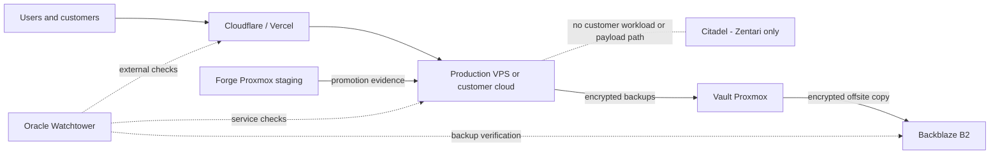

# Architecture

## Purpose

The reference architecture separates public experience, business production, private AI, staging, infrastructure, offsite operations, and backups into distinct failure and trust domains.

## Current state (observed, 2026-08-07)

| Platform | Observed role | Known capacity or condition |
|---|---|---|
| Production VPS | Production business services | Stateful production host; exact inventory requires validation |
| Citadel | Zentari-only AI compute | Local inference and private AI services; customer production prohibited |
| Primary Proxmox | Staging/development | 32 logical CPUs, 126 GB RAM; storage layout requires validation |
| Dell R410 / ESXi 6.7 | Legacy utility host | 12 logical CPUs, 56 GB RAM, approximately 1.8 TB datastore; conversion planned |
| Oracle OCI | Offsite node | Observed 4 OCPU, 24 GB RAM, 200 GB; billing/free-tier status must be verified |
| Vercel / Cloudflare | Public web delivery | Public websites and web applications |
| Backblaze B2 | Offsite backup | Existing offsite destination; bucket, retention, and restore evidence require inventory |

The conversation noted duplicate or experimental n8n, LiteLLM, PostgreSQL, and other services. Their location and authority remain unverified; no migration should assume the duplicates are disposable.

## Target state

| Plane | Canonical owner | Responsibilities |
|---|---|---|
| Public experience | Cloudflare + Vercel | DNS, edge controls, website, portals, landing pages, public web applications |
| Business production | VPS / customer cloud | Twenty or HubSpot integration, n8n production, AppFlowy, approved databases, production APIs |
| AI | Citadel | Zentari-only inference, LiteLLM routing, Hermes, embeddings, Qdrant, internal agent workloads |
| Development | Primary Proxmox (`forge`) | Staging, integration testing, upgrade rehearsal, disposable test environments |
| Infrastructure | Converted Proxmox (`vault`) | Local backups, monitoring storage, restore tests, templates, caches, build services |
| Operations / DR | Oracle OCI (`watchtower`) | External probes, alerting, DNS/TLS checks, backup verification, remote recovery automation |
| Offsite backup | Backblaze B2 | Encrypted, immutable-by-policy recovery copies separate from production object storage |

## Core flows

Citadel is not a transitive hosting or inference shortcut: customer data, payloads, and services stay in their approved production boundary. Customer AI runs on a separately deployed endpoint in the VPS or customer-controlled cloud; it does not route through Zentari's Citadel.

## Data ownership

- Packaged self-hosted applications keep their databases close to the production application on the VPS/customer cloud.
- Custom public applications may use managed Supabase when its operational benefits justify it; Supabase is optional, not the default database for packaged applications.
- Twenty is the preferred self-hosted CRM candidate. HubSpot Free remains a supported SaaS alternative.
- n8n orchestrates cross-system workflows. It must not silently become the system of record.
- Production file storage and backup storage use separate buckets, credentials, and lifecycle policies.

## Availability model

This baseline favors recoverability over premature high availability. A second VPS is added only for measured capacity, customer isolation, availability requirements, or failure-domain separation. Watchtower detects failures; it does not automatically become the production business host.

## Supporting documents

- [Platform principles](docs/01-overview/principles.md)
- [Server roles](docs/02-infrastructure/server-roles.md)
- [Production services](docs/03-production/services.md)
- [Citadel](docs/04-ai/citadel.md)
- [Observability](docs/06-observability/strategy.md)
- [Backup and DR](docs/07-backup-dr/strategy.md)
- [Security](docs/08-security/security-model.md)
- [Customer patterns](docs/09-customer-patterns/deployment-patterns.md)
